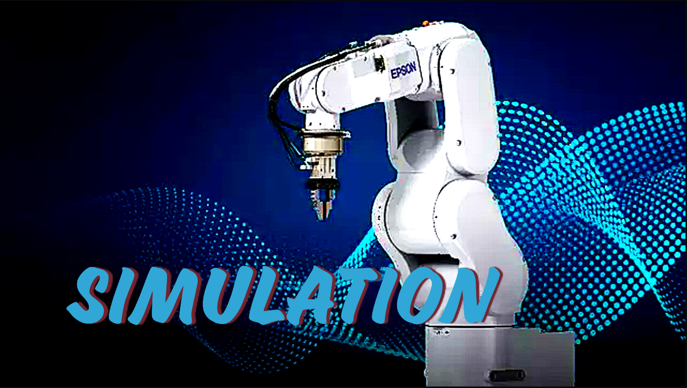

# Task 1: Pick and Place
## Simulation
<p align="center">
<a  href="https://youtu.be/znjjijPPfI8" target="_blank">
    
</a>
</p>

## SPEL+ Code
```
Function PickPlace
Motor On
Power High
Tool 1
Speed 30
Accel 30, 30
SpeedS 500
AccelS 5000

'Define Difference Between Tray Positions...
Global Long Dx
Global Long Dy

'Define Block Off-Set Alignment Positions...
Global Real Bx
Global Real By

'Define Coin Off-Set Alignment Positions...
Global Real Mx
Global Real My

Dx = -18.22
Dy = 24.06
Bx = -15
By = 0
Mx = -15
My = 0

'Define Control Box Switches...
Start_Loop:
Wait Sw(0) = On
Xqt Task1
Do While Sw(0) = On
       If Sw(5) = On Then
              Halt Task1
       EndIf
       If Sw(7) = On Then
              Quit Task1
              Reset
              Go P0
              Off 8
              Off 12
              GoTo Start_Loop
       EndIf
       If Sw(6) = On Then
              Resume Task1
       EndIf
       If Sw(4) = On Then
              Quit Task1
              On 12
       EndIf
Loop
Halt Task1
Fend 'Ends The Main Function


Function Task1 'Executes the Pick and Place tasks
Go SafetyPosition
Call FOR3
Call FOR4
Go SafetyPosition
Fend


Function FORCOINS 'For Coin Tokens
Integer i
For i = 0 To 2
       Go P1 +Z(50) 'Goes to the Picking Positions
       Wait 0.5
       Go P1 +Z(-6 * i)
       Wait 0.5
       On 8
       Wait 0.5

       Go P1 +Z(50) 'Goes to the Fixture Positions
       Go P3 +X(Mx) +Y(My) +Z(30)
       Wait 0.5
       Go P3 +X(Mx) +Y(My)
       Wait 0.5
       Off 8
       
       Go P3 +X(-Mx) +Y(-My) 'Aligns the Tokens
       Go P3 +X(-Mx) +Y(-My) +Z(10)
       Go P3 +Z(10)
       Go P3
       Wait 0.5
       On 8

       Go P3 +Z(30) 'Goes to Tray Positions
       Go P5 +X(Dx * i) +Y(Dy * i) +Z(30)
       Go P5 +X(Dx * i) +Y(Dy * i)
       Wait 0.5
       Off 8

       Go P5 +X(Dx * i) +Y(Dy * i) +Z(30) 'Ends Action       
       Next i
Fend


Function FORBLOCKS 'For Block Tokens
Integer i
For i = 0 To 2
       Go P2 +Z(50) 'Goes to Picking Positions
       Wait 0.5
       Go P2 +Z(-6 * i)
       Wait 0.5
       On 8
       
       Go P2 +Z(50) 'Goes to Fixture Positions
       Go P4 +X(Bx) +Y(By) +Z(30)
       Wait 0.5
       Go P4 +X(Bx) +Y(By)
       Wait 0.5
       Off 8
       
       Go P4 +X(-Bx) +Y(-By) 'Aligns Tokens
       Go P4 +X(-Bx) +Y(-By) +Z(10)
       Go P4 +Z(10)
       Go P4
       Wait 0.5
       On 8

       Go P4 +Z(30) 'Goes to Tray Positions
       Go P6 +X(Dx * i) +Y(Dy * i) +Z(30)
       Go P6 +X(Dx * i) +Y(Dy * i)
       Wait 0.5
       Off 8
       
       Go P6 +X(Dx * i) +Y(Dy * i) +Z(30) 'Ends Action
       Next i
Fend
```
